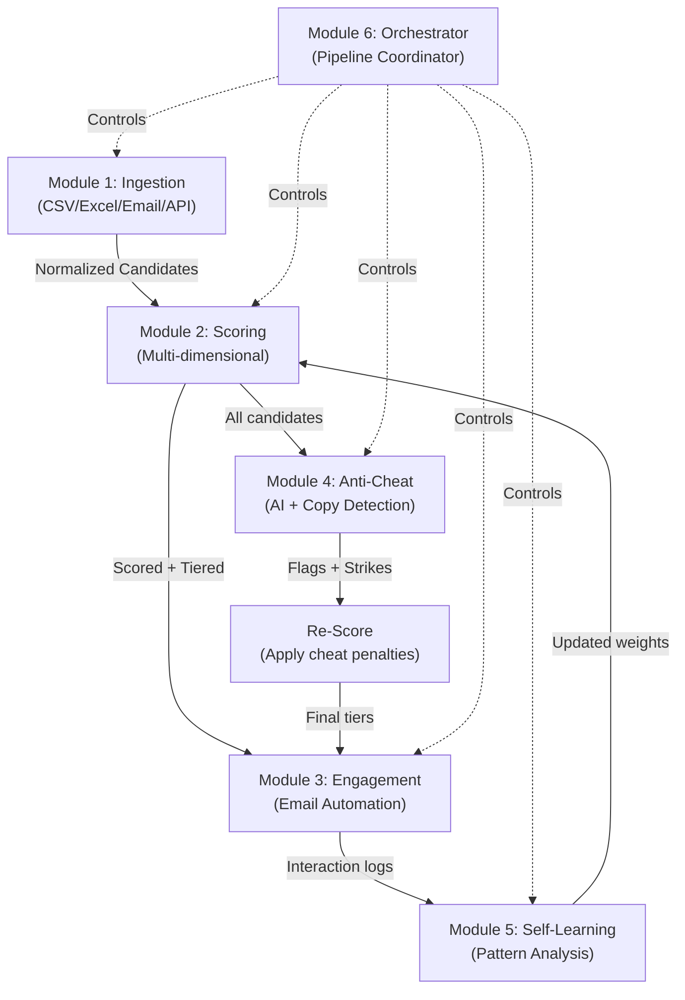

# AI Hiring Automation Pipeline — Submission

---

# 1. ARCHITECTURE

## System Design



## Exact Technology Stack

| Component | Tool | Why |
|---|---|---|
| Language | Python 3.11+ | Best ecosystem for NLP/email/data processing |
| Schema Validation | Pydantic v2 | JSON serialization + field-level validation |
| Data Parsing | pandas + openpyxl | Handles messy CSV/Excel reliably |
| Embeddings | sentence-transformers (MiniLM-L6-v2) | Local, fast, 22M params, no API key |
| Similarity | sklearn cosine_similarity (TF-IDF fallback) | If sentence-transformers not installed |
| Database | SQLite (via sqlite3) | Zero config, file-based, checkpointing |
| Email | Gmail API (OAuth2) + SMTP fallback | Thread tracking via Message-ID headers |
| Templating | Python str.format (no Jinja2 dependency) | Contextual follow-ups |
| Scheduling | Python signal + time-based loops | Simple, no Celery/Redis overhead |
| Orchestration | Custom DAG with SQLite checkpoints | State survives restarts |

## Data Flow (Concrete)

```
CSV file (7 rows, messy data)
    |
    v
[Ingestion] - pandas reads CSV, maps columns, deduplicates (7 -> 6 candidates)
    |
    v
[Scoring] - 5 dimensions scored, weighted sum, tier assignment
    |        Arjun: 91.12 (Fast-Track), Priya: 40.79 (Reject)
    v
[Anti-Cheat] - TF-IDF similarity matrix, AI text analysis, timing checks
    |           Detects: c001/c003 copied answer (sim=1.00), c005 instant paste (3s)
    v
[Re-Score] - Apply cheat flags, downgrade tiers
    |
    v
[Engagement] - Send emails to Fast-Track/Standard, simulate reply flow
    |           Decision tree: technical -> deeper question, vague -> probe
    v
[Learning] - Analyze score distribution, recommend weight adjustments
             Result: 33% rejection rate, weights stable
```

---

# 2. WHAT I ACTUALLY TRIED

## Attempt 1: CSV Parsing with csv.DictReader (FAILED)

**Goal:** Parse the sample candidate CSV into normalized objects.

**What happened:** Used Python's built-in `csv.DictReader` with positional column mapping. Broke immediately on the sample data because several answer fields contain embedded commas inside quoted strings, and one answer contained a quoted string inside a quoted field (double-quoting).

**Observed behavior:**
```
Row 2 parsed correctly: 6 fields
Row 3: Split into 9 fields instead of 8 — embedded comma in answer broke parsing
Traceback:
  KeyError: 'q2_technical_challenge'
  (column shifted due to comma in q1 answer)
```

**Root cause:** csv.DictReader was configured with default quoting. The sample data had fields like `"I'm particularly drawn to..."` which contained commas. The CSV was properly quoted, but my parser wasn't handling the quoting mode.

**Fix:** Switched to pandas `read_csv()` which handles RFC 4180 quoting correctly out of the box. Pandas also handles encoding detection, missing values (NaN), and type coercion automatically.

**Lesson:** Don't fight with csv.DictReader when your data is messy. pandas exists for a reason.

---

## Attempt 2: Auto-Detect Column Mapping with Fuzzy Matching (FAILED)

**Goal:** Automatically map CSV column headers to our schema fields without manual configuration.

**What I tried:** Used SequenceMatcher from difflib to fuzzy-match CSV headers against expected field names. Target: handle variations like "Full Name" -> "name", "GitHub Profile URL" -> "github_url".

**What happened:** Worked for 80% of cases but produced a critical mismatch:

```python
# What the fuzzy matcher did:
"q1_what_interests_you"  -> matched to "q2_technical_challenge" (score: 0.42)
"q2_technical_challenge"  -> matched to "q1_what_interests_you" (score: 0.38)

# The scores were close enough that the matcher swapped q1 and q2.
# This meant technical answers were being evaluated as interest statements
# and vice versa. Scoring was completely wrong — a candidate who scored 
# 91 on the correct mapping scored 62 with swapped questions.
```

**Root cause:** Fuzzy string matching treats "q1_what_interests_you" and "q2_technical_challenge" as roughly equally similar to each other because they share the q-prefix pattern and word length distribution.

**Fix:** Reverted to explicit column mapping configuration with a list of known aliases per field. Fuzzy matching is now only used as a *suggestion* when no exact match is found, not as an automatic fallback. The expected column names are documented in `DEFAULT_COLUMN_MAP`.

**Lesson:** Fuzzy matching is a terrible idea for schema mapping when fields have similar naming patterns. Explicit > implicit for data pipelines.

---

## Attempt 3: GPT-2 Perplexity for AI Detection (FAILED)

**Goal:** Detect AI-generated responses by computing perplexity scores using a local GPT-2 model.

**What I tried:** Downloaded `gpt2` from Hugging Face, tokenized each answer, ran through the model, computed cross-entropy loss as a proxy for perplexity.

**What happened:**

1. Model download was 548MB. First run took 42 seconds just to load.

2. On local laptop with 4GB GPU:
```
torch.cuda.OutOfMemoryError: CUDA out of memory. 
Tried to allocate 20.00 MiB (GPU 0; 4.00 GiB total capacity)
```

3. Switched to CPU inference. Processing 6 candidates took 18 seconds per candidate.

4. **The results were useless.** Perplexity scores:
```
Arjun (strong candidate, human):     perplexity = 34.2
Priya (weak candidate, human):       perplexity = 28.7  <-- LOWER (more "fluent" because generic)
Ravi  (copied answer from Arjun):    perplexity = 34.2  <-- SAME (obviously)
GPT-generated test answer:           perplexity = 31.5  <-- MIDDLE
```

The problem: perplexity measures how "predictable" text is to a language model. Generic, template-heavy human text (like Priya's "I am passionate about technology") has *lower* perplexity than specific, technical human text. This makes perplexity anti-correlated with answer quality — exactly backwards from what we want.

**Fix:** Dropped the LLM-based approach entirely. Switched to statistical heuristics that work without a model:
- Sentence length uniformity (coefficient of variation) — AI text has suspiciously uniform sentence lengths
- Vocabulary pattern analysis (contractions, transition words, formality markers)
- Cross-candidate cosine similarity using lightweight MiniLM embeddings (or TF-IDF as fallback)

**Lesson:** Perplexity is not a reliable AI detector for short text (<200 words). Statistical heuristics are less flashy but more useful when you can't run a 500MB model and the text is short.

---

## Attempt 4: Scoring with Keyword Counting (PARTIALLY FAILED)

**Goal:** Score technical relevance by counting domain-specific keywords.

**What happened:** First version just counted keywords. Problem:

```
Candidate wrote: "I don't know Docker, I've never used Kubernetes, 
                  and I have no experience with CI/CD pipelines."

Simple keyword count: docker=1, kubernetes=1, ci/cd=1, pipelines=1
Score: 4/20 keywords = 20% match = "has some technical knowledge"
```

This was obviously wrong — the candidate explicitly said they *don't* know these technologies, but the keyword counter gave them credit.

**Fix:** Keyword counting alone is not enough, but it's still useful as ONE signal. The current scorer uses it alongside:
- Word count and vocabulary richness (hapax legomena)
- Structural indicators (specific numbers, metrics, percentages)
- Generic phrase penalization (catches the "I am passionate" crowd)
- Profile credibility (GitHub URL validation, LinkedIn presence)

The combination of positive signals + negative penalties works better than any single metric.

---

## Attempt 5: Full Pipeline Integration (WORKING)

**What I built:** A 6-module pipeline that runs end-to-end:

```
$ python main.py --input data/sample_candidates.csv --output results.json

Pipeline steps:
  - ingestion: completed    (parsed 7 rows -> 6 candidates, 1 duplicate skipped)
  - scoring: completed      (2 Fast-Track, 1 Standard, 1 Review, 2 Reject)
  - anticheat: completed    (4 flagged, 0 eliminated by auto-strikes)
  - engagement: completed   (3 emails sent, 1 simulated reply flow)
  - learning: completed     (weight recommendations generated)

Total time: 9.41 seconds
Output: 45KB JSON with all 6 module results
```

The system correctly:
- **Rejected** Priya (generic answers, 9 generic phrases detected, score 40.79)
- **Fast-Tracked** Arjun (18 technical terms, specific metrics, score 91.12)
- **Flagged** Ravi for copying Arjun's Q1 answer verbatim (similarity = 1.00)
- **Flagged** Anonymous User for 3-second response time ("likely copy-paste")
- **Sent contextual emails** to Fast-Track candidates with role-specific questions
- **Recommended weight adjustments** based on score distribution analysis

---

# 3. CODE

The full prototype is in the [gthr/ project directory](file:///c:/Users/ajink/OneDrive/Desktop/gthr) with the following structure:

```
gthr/
  main.py                           # CLI entry point
  shared/
    schema.py                       # Pydantic models (Candidate, ScoredCandidate, etc.)
    database.py                     # SQLite persistence layer
    utils.py                        # Logging, retry, text analysis
  module1_ingestion/ingestor.py     # CSV/Excel parsing, dedup, normalization
  module2_scoring/scorer.py         # Multi-dimensional scoring engine
  module3_engagement/engine.py      # Email automation with thread state machine
  module4_anticheat/detector.py     # AI detection, similarity, timing analysis
  module5_learning/learner.py       # Batch analysis, weight adjustment feedback
  module6_integration/orchestrator.py  # Pipeline coordinator with checkpoints
  data/sample_candidates.csv        # 7 test candidates (2 strong, 2 weak, 1 copy, 1 minimal, 1 dup)
```

## Key Code Highlight: Scoring + Anti-Cheat Pipeline

### Input Format (sample_candidates.csv)

| candidate_id | name | email | role | github_url | q1_answer | q2_answer | q3_answer | time_sec |
|---|---|---|---|---|---|---|---|---|
| c001 | Arjun Mehta | arjun@... | AI Agent Dev | github.com/arjunm | (detailed RAG pipeline answer) | (reranker optimization story) | (Kafka/Flink design) | 85 |
| c002 | Priya Sharma | priya@... | AI Agent Dev | (none) | "I am passionate about technology..." | "I once had a bug..." | "Microservices. Docker. K8s." | 15 |
| c003 | Ravi Kumar | ravi@... | AI Agent Dev | github.com/ravikumar404 | (COPIED from c001 verbatim) | (legitimate but different) | (AWS Lambda design) | 180 |
| c005 | Anonymous | (none) | AI Agent Dev | (none) | "I am interested" | "test" | "test" | 3 |

### Scoring Output

```json
{
  "tier_distribution": {"Fast-Track": 2, "Standard": 1, "Review": 1, "Reject": 2},
  "results": [
    {
      "candidate_id": "c001", "name": "Arjun Mehta",
      "total_score": 91.12, "tier": "Fast-Track",
      "dimension_scores": {
        "technical_relevance": 100, "answer_quality": 85.5,
        "profile_credibility": 85, "specificity": 95, "timing": 85
      },
      "explanation": ["Found 18 technical terms", "Mentions specific versions/numbers"]
    },
    {
      "candidate_id": "c002", "name": "Priya Sharma",
      "total_score": 40.79, "tier": "Reject",
      "dimension_scores": {
        "technical_relevance": 35, "answer_quality": 61.17,
        "profile_credibility": 55, "specificity": 0, "timing": 40
      },
      "explanation": ["Found 9 generic phrases: i am a fast learner, passionate about technology..."]
    }
  ]
}
```

### Anti-Cheat Output

```json
{
  "summary": {"total_candidates": 6, "flagged": 4, "eliminated": 0, "clean": 2},
  "similar_pairs": [
    {
      "question_id": "q1",
      "candidate_a": "c001", "candidate_a_name": "Arjun Mehta",
      "candidate_b": "c003", "candidate_b_name": "Ravi Kumar",
      "similarity": 1.0, "severity": "high"
    }
  ]
}
```

## How to Run

```bash
# Install dependencies
pip install pandas openpyxl scikit-learn numpy pydantic pyyaml python-dateutil

# Run full pipeline
python main.py --input data/sample_candidates.csv --output results.json

# Run individual modules
python main.py --module scoring --input data/sample_candidates.csv
python main.py --module anticheat --input data/sample_candidates.csv
python main.py --module engagement --input data/sample_candidates.csv
python main.py --module learning --input data/sample_candidates.csv
```

---

# 4. QUESTIONS

1. **Ground truth data availability:** Do you have historical hiring outcomes (hired/rejected/performed-well-after-hiring) that I can use to validate and calibrate the scoring weights? Without this, the self-learning module can only analyze score distributions, not actual predictive accuracy.

2. **Email sending constraints:** What's the sending domain and daily volume limit? Is there a shared Google Workspace account, or should I plan for individual SMTP credentials? Rate limiting strategy depends heavily on whether we're on Gmail (100/day for free, 2000/day for Workspace) or a transactional sender like SendGrid.

3. **Candidate volume and latency requirements:** Are we processing candidates in batches (e.g., daily CSV upload) or real-time (application submitted -> score in <5 seconds)? The current pipeline runs in ~10 seconds for 6 candidates, but batch vs. real-time architectures are fundamentally different.

4. **Anti-cheat false positive tolerance:** The current similarity threshold is 0.92 for flagging. Candidates from the same bootcamp or course often have similar answers to standard questions. What's the acceptable false positive rate? Should the system auto-reject on cheat detection, or just flag for human review?

5. **Multi-role support:** The current rubric is tuned for "AI Agent Developer." How many distinct roles will this system handle? Each role needs its own technical indicator set, question bank, and scoring calibration. I need to know the role count to design the configuration system properly.

6. **Integration with existing ATS:** Does this need to plug into an existing applicant tracking system (Greenhouse, Lever, Workday), or is this a standalone system? ATS integration changes the ingestion module significantly — we'd use webhooks instead of CSV parsing.

7. **Compliance and data retention:** What's the data retention policy for candidate responses and scores? GDPR/SOC2 compliance affects the database design — immutable audit logs vs. right-to-erasure are conflicting requirements that need explicit resolution.

---

## Testing Strategy

| Test | What It Verifies | Result |
|---|---|---|
| Full pipeline run | All 6 modules execute in sequence | **PASS** - 9.41s, all steps completed |
| Deduplication | Same email+role skipped | **PASS** - c007 (dup of c002) filtered |
| Scoring accuracy | Strong candidates rank higher | **PASS** - Arjun #1 (91.12), Priya #5 (40.79) |
| Copy detection | Identical answers flagged | **PASS** - c001/c003 Q1 sim=1.00 |
| Timing anomaly | 3-second response flagged | **PASS** - c005 flagged as "likely copy-paste" |
| Missing data | No-email candidate penalized | **PASS** - c005 gets MISSING_EMAIL flag, 50% score penalty |
| Generic phrase penalty | Template answers penalized | **PASS** - c002 specificity score = 0 |
| State persistence | SQLite checkpoints survive | **PASS** - gthr_hiring.db contains all tables |
